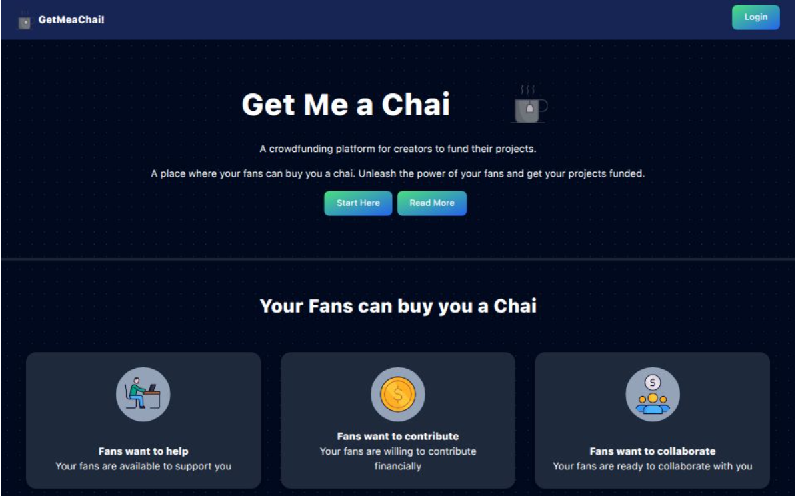
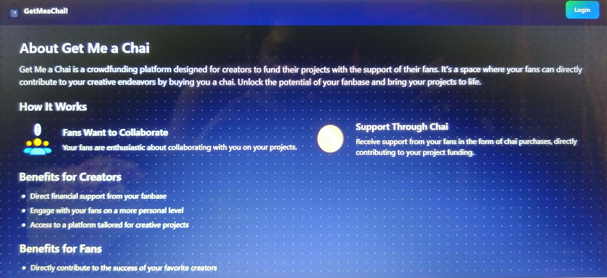
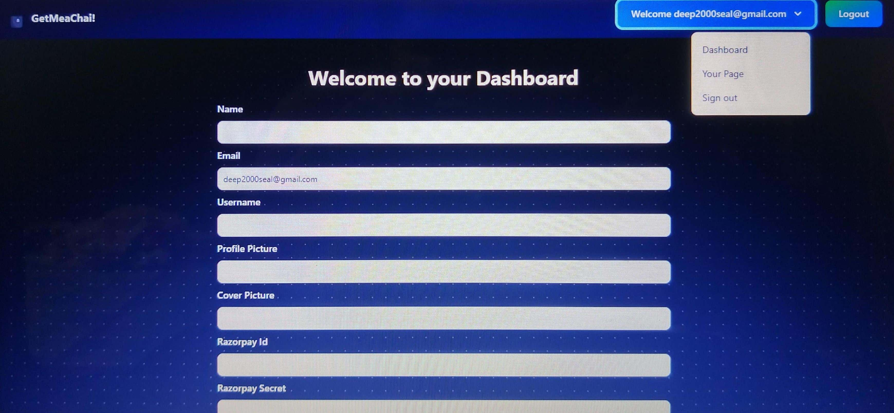
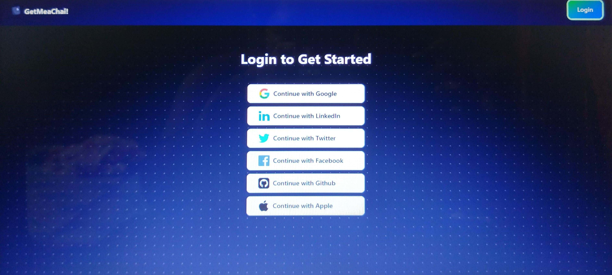
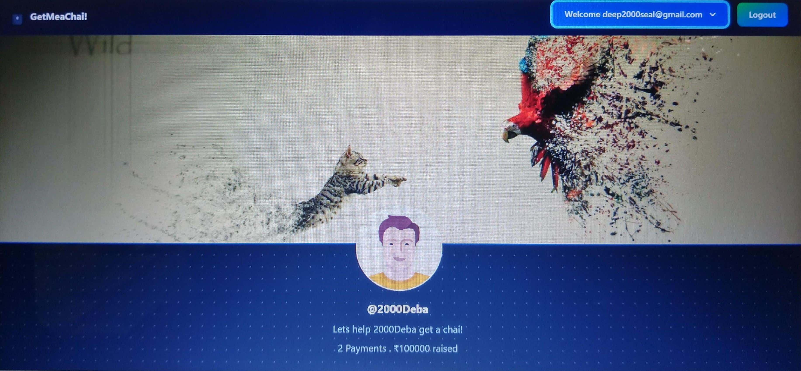
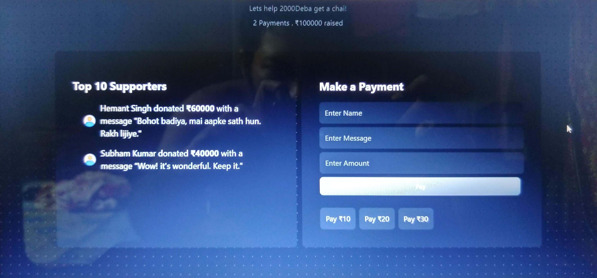

# ☕ Get Me a Chai


A full-stack web application where creators can receive support from their fans in the form of "chai" (contributions). Built using **Next.js**, **MongoDB**, **Razorpay**, and **NextAuth**, it provides a seamless and secure payment experience.

---

## 📖 About

**Get Me a Chai** is a **Buy Me a Coffee**-style platform that allows creators to connect with their supporters and receive payments directly. Fans can show their appreciation by buying "chai" for their favorite creators. The project is fully responsive, deployed on **Vercel**, and integrated with **MongoDB Atlas** for data storage and **Razorpay** for secure transactions.

---

## 🚀 Features

- 🔐 **Secure authentication** with **NextAuth** (Google & GitHub OAuth)
- 💳 **Seamless Razorpay payment integration**
- 📦 **MongoDB Atlas** for scalable data storage
- 📱 **Fully responsive UI** built with **Tailwind CSS**
- 🌐 **Deploy-ready** with **Vercel**

---

## 📸 Screenshots








---

## 🛠️ Tech Stack

**Frontend:** Next.js, React, Tailwind CSS  
**Backend:** Node.js, Express.js (API Routes via Next.js)  
**Database:** MongoDB Atlas  
**Authentication:** NextAuth (Google & GitHub OAuth)  
**Payments:** Razorpay  
**Deployment:** Vercel

---

## ⚡ Getting Started

Follow these steps to set up the project locally:

### 1️⃣ Clone the repository
```bash
git clone https://github.com/2000Deba/getmychai.git
cd getmychai
```

### 2️⃣ Install dependencies
```bash
npm install
```

### 3️⃣ Set up environment variables

Create a `.env.local` file in the root folder and add:

```env
MONGODB_URI=your_mongodb_connection_string
NEXTAUTH_URL=http://localhost:3000
NEXTAUTH_SECRET=your_nextauth_secret
RAZORPAY_KEY_ID=your_razorpay_key_id
RAZORPAY_KEY_SECRET=your_razorpay_key_secret
NEXT_PUBLIC_URL=http://localhost:3000
GITHUB_ID=your_github_oauth_id
GITHUB_SECRET=your_github_oauth_secret
GOOGLE_ID=your_google_oauth_id
GOOGLE_SECRET=your_google_oauth_secret
```

### 4️⃣ Run the development server
```bash
npm run dev
```

The app will be live at **http://localhost:3000** 🚀

---

## 🚀 Deployment

This project is optimized for **Vercel** deployment:

1. Push your code to GitHub.
2. Go to [Vercel](https://vercel.com/).
3. Import the project from GitHub.
4. Add your environment variables in Vercel's dashboard.
5. Deploy 🚀

Live Demo: **[https://getmychai.vercel.app/](https://getmychai.vercel.app/)**

---

## 👨‍💻 Author

**Debasish Seal**  
💻 [GitHub](https://github.com/2000Deba)  
🌐 [Portfolio](https://portfolio-mqbv.vercel.app/)  

---

## ⭐ Show Your Support

If you like this project, please consider giving it a ⭐ on [GitHub](https://github.com/2000Deba/getmychai) 🙌

---
